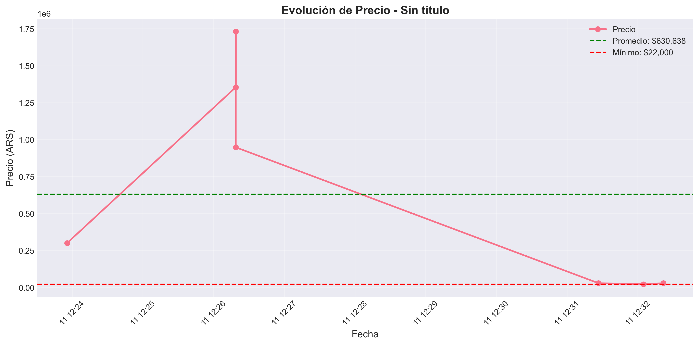

# 🛍️ Monitor de Precios MercadoLibre

Sistema de seguimiento automático de precios de productos en MercadoLibre. Rastrea productos, detecta cambios de precio y genera análisis visual del histórico.


## ¿Qué hace?

- Busca productos en MercadoLibre y guarda los precios
- Actualiza precios automáticamente  
- Te avisa cuando hay cambios importantes
- Genera gráficos para ver cómo varían los precios
- Recomienda cuándo es buen momento para comprar

## Demo



*Ejemplo: evolución del precio de un producto a lo largo del tiempo*

## Instalación Rápida
```bash
# Clonar proyecto
git clone https://github.com/Vladimir-Bulan/mercadolibre-price-monitor.git
cd mercadolibre-price-monitor

# Instalar dependencias
pip install -r requirements.txt

# Abrir notebooks
jupyter notebook
```

## Cómo usar

### Notebooks (recomendado)

Los notebooks te guían paso a paso:

1. `01_setup_and_test.ipynb` - Prueba que todo funcione
2. `02_scraping_basics.ipynb` - Busca y guarda productos
3. `03_price_tracking.ipynb` - Rastrea cambios de precio
4. `04_data_analysis.ipynb` - Analiza y visualiza datos

### Código directo
```python
from scraper import MercadoLibreScraper
from database import PriceDatabase

# Buscar productos
scraper = MercadoLibreScraper()
products = scraper.search_products("notebook lenovo", limit=10)

# Guardar en base de datos
db = PriceDatabase("data/prices.db")
for product in products:
    db.save_price(product)
```

## Stack

- **Python 3.13** - Lenguaje base
- **BeautifulSoup** - Web scraping
- **Pandas** - Análisis de datos
- **Plotly/Matplotlib** - Gráficos
- **SQLite** - Base de datos

## Estructura
```
mercadolibre-price-monitor/
├── 01-04_*.ipynb          # Notebooks principales
├── scraper.py             # Lógica de scraping
├── database.py            # Manejo de BD
├── analyzer.py            # Análisis y gráficos
├── utils.py               # Utilidades
├── output/                # Gráficos generados
└── requirements.txt       # Dependencias
```

## Funcionalidades

**Scraping**
- Búsqueda de productos por término
- Extracción de precio, título, vendedor
- Rate limiting para no saturar el servidor

**Base de Datos**
- Histórico completo de precios
- Queries optimizadas
- SQLite portable

**Análisis**
- Precio min/max/promedio
- Detección de cambios >5%
- Scoring de oportunidad de compra (1-5 ⭐)
- Comparación entre productos

**Visualización**
- Gráficos de evolución temporal
- Histogramas de distribución
- Dashboard interactivo con Plotly

## Roadmap

- [x] Sistema base de scraping
- [x] Base de datos y tracking
- [x] Análisis y visualizaciones
- [ ] Dashboard web (Streamlit)
- [ ] Notificaciones automáticas
- [ ] ML para predicción de precios

## Nota Legal

Proyecto educativo. Respeta el `robots.txt` y términos de servicio de MercadoLibre. Incluye delays entre requests. Solo para uso personal/aprendizaje.

## Autor

Vladimir Bulan  
[GitHub](https://github.com/Vladimir-Bulan)

---

*Si te sirvió el proyecto, ⭐ dale una estrella!*
